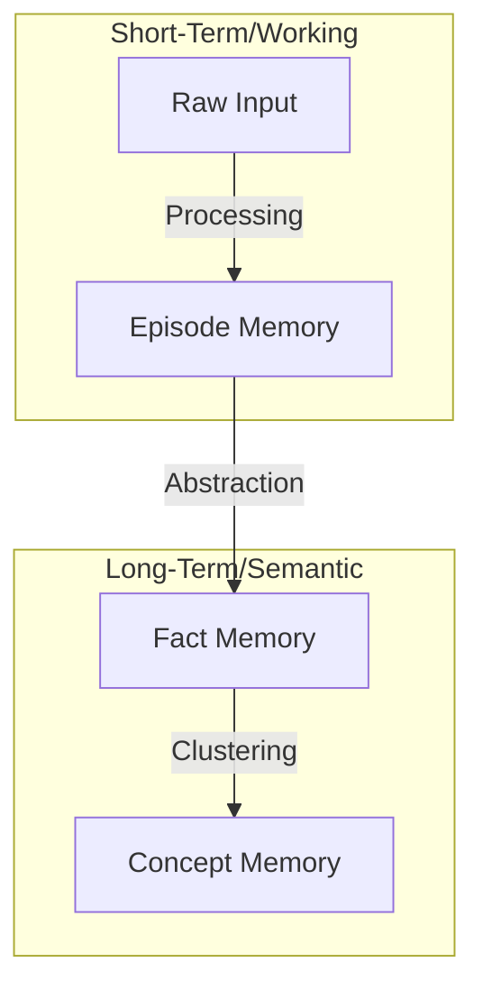

# 🧠 Cortex Memory Engine: The Cognitive Core for AI Agents

[](https://github.com/lowkon123/AI-Cortex-Memory-System/blob/main/LICENSE)
[](https://www.python.org/)
[]()

> "Cortex is not a database. It is a cognitive layer that gives AI agents a sense of time, continuity, and structured knowledge."

Cortex Memory Engine is a high-performance, hierarchical memory system designed to solve the "LLM amnesia" problem. By mimicking human cognitive patterns, it allows agents to store, recall, and self-organize information across sessions without exploding the token context.

---

## 🚀 Key Highlights (Cortex 2.0 Upgrade)

- **[屌!!!] Autonomous Fact Extraction**: Automatically distills raw conversation into structured, durable facts.
- **Hierarchical Cognitive Stack**: Multi-layer memory (Raw -> Episode -> Fact -> Concept) for extreme token efficiency.
- **Semantic Knowledge Graph**: Native relationship tracking (`supports`, `contradicts`, `causes`) for logical reasoning.
- **Hybrid Retrieval Engine**: Blazing fast Full-Text Search (FTS) combined with Vector Cosine Similarity.
- **3D Interactive Dashboard**: Real-time visualization of your agent's mind through 3D clusters and emotional polarity.

---

## 🏗️ The Cognitive Stack (Architecture)

Traditional vector databases treat all text equally. Cortex uses a **4-Layer Cognitive Hierarchy**:



1.  **Raw Input**: Verbatim logs of the interaction.
2.  **Episode Memory**: Temporal-based events summarizing "what happened" today.
3.  **Fact Memory**: Structural knowledge about the user or project (e.g., "User prefers React").
4.  **Concept Memory**: High-level abstract Terminology and entity clusters.

---

## 🕸️ Knowledge Graph & Semantic Linking

Cortex doesn't just find "similar" text; it understands **relationships**. When memories are stored, Cortex builds directed edges:
- **`SUPPORTS`**: Validates existing knowledge.
- **`CONTRADICTS`**: Flags conflicting information for human review.
- **`PART_OF`**: Links specific details to broader episodes.

---

## 🔍 Hybrid Cognitive Retrieval

Stop choosing between "Exact Match" and "Fuzzy Search". Cortex uses a unified scoring algorithm:

| Factor | Weight | Description |
| :--- | :--- | :--- |
| **Vector Similarity** | 20% | Semantic "meaning" overlap. |
| **Recency** | 12% | Boost for recent events. |
| **Importance** | 14% | Manual or AI-assigned significance. |
| **Token Efficiency** | 10% | Prefers concise summaries over bloated raw text. |
| **Novelty** | 4% | Penalty for redundant information in the same context. |

---

## 📊 3D Awareness Dashboard

Visualize your agent's thought process in a real-time 3D environment.
- **Cluster Visualization**: See how segments of memory naturally group by topic.
- **Emotional Polarity**: Color-coded nodes reflecting the sentiment (positive/negative) of the memory.
- **Live Interaction**: Edit, delete, or manually link memories directly from the UI.

---

## 💤 Autonomous Memory Lifecycle (The Sleep Cycle)

Memories are not static. Cortex performs autonomous maintenance during "Sleep":
- **Deduplication**: Merges highly similar memories to save token space.
- **Neural Decay**: Importance of trivial information fades over time to preserve "clean" recall.
- **Consolidation**: Moving frequent episodic patterns into permanent Facts.

---

## 🛠️ Zero-to-Hero: Quick Start

### 1. Prerequisites (Fresh Machine Setup)
- [Python 3.10+](https://www.python.org/)
- [Git](https://git-scm.com/)
- [Docker Desktop](https://www.docker.com/products/docker-desktop/)
- [Ollama](https://ollama.com/) (For local embeddings)

### 2. Prepare Environment
```bash
# Clone the mind
git clone https://github.com/lowkon123/AI-Cortex-Memory-System.git
cd AI-Cortex-Memory-System

# Setup Virtual Environment
python -m venv venv
.\venv\Scripts\activate

# Install Dependencies
pip install -r requirements.txt
```

### 3. Launch Services
```bash
# 1. Pull the embedding model
ollama pull bge-m3

# 2. Start PostgreSQL/pgvector
docker-compose up -d

# 3. Launch Everything (Windows)
.\launch_services.bat
```

---

## 🔌 MCP Native Support (Claude/Cursor)

Cortex is fully compatible with the **Model Context Protocol (MCP)**. You can add it as a tool to **Claude Desktop** or **Cursor**:

**Config Example (`.mcp.json`):**
```json
{
  "mcpServers": {
    "cortex": {
      "command": "python",
      "args": ["d:/path/to/cortex_mcp_server.py"]
    }
  }
}
```

---

## 🤖 Integration for Custom Agents

### The 3-Endpoint Pattern
Integrate Cortex into any AI loop using three simple HTTP calls:

1.  **`POST /agent/context`**: Get relevance-ranked context for your next prompt.
2.  **`POST /agent/store`**: Save the current turn or interesting project findings.
3.  **`POST /agent/reinforce`**: Tell Cortex which memories helped the most.

---

## 🗺️ Roadmap

- [ ] **Multimodal Memory**: Support for images and diagram embeddings.
- [ ] **Distributed Cortex**: Syncing memories across multiple local machines.
- [ ] **Proactive Recall**: Allow agents to "dream" and notice connections autonomously.
- [ ] **Temporal Graph**: Visualizing how knowledge evolved over months.

---

## 📜 License & Contributing

Cortex is licensed under the MIT License. Contributions are welcome to build the future of AI cognitive science.

---
**Cortex Memory System - Give your AI a brain.**
