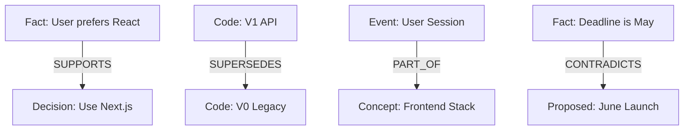
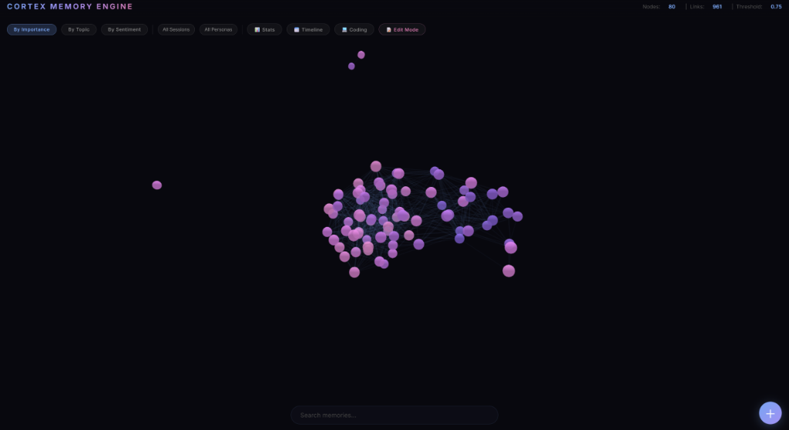
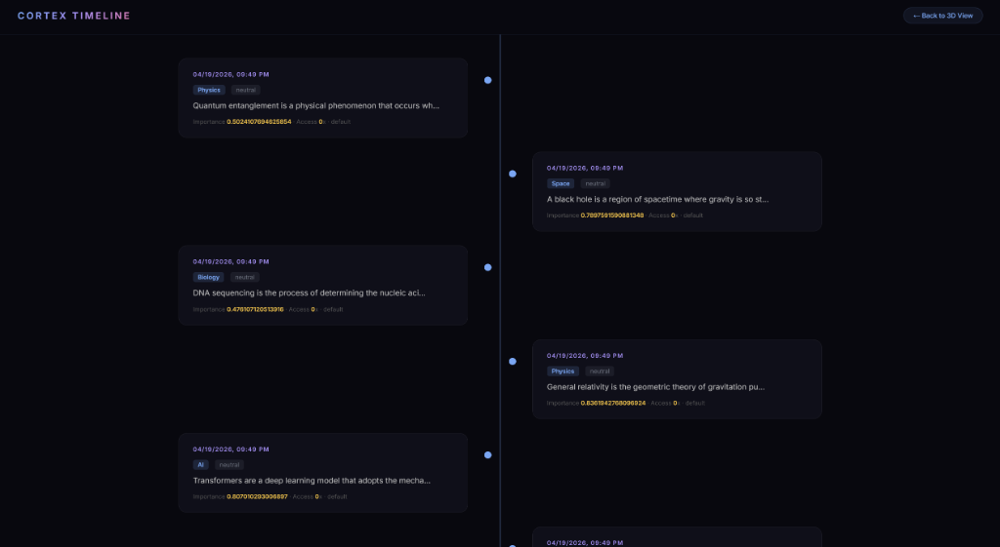
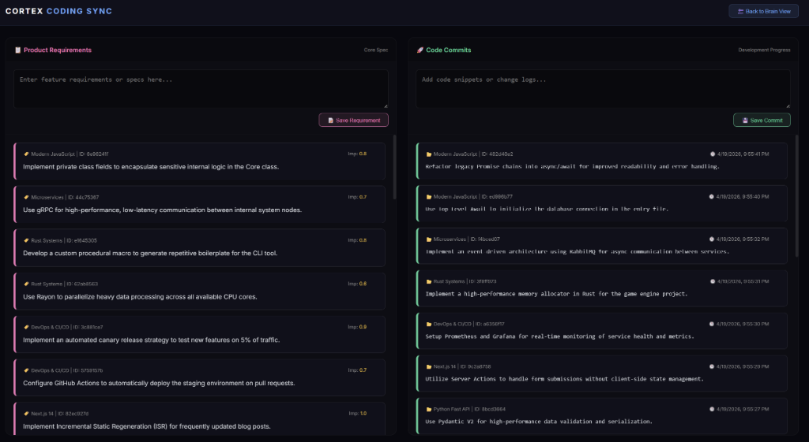

# 🧠 Cortex Memory Engine
> **Non-Linear Hierarchical Memory Engine: A Persistent Digital Brain for Sophisticated AI Agents**

[中文版 (Chinese)](README_ZH.md) | [English](README.md)

---

## 🌌 The Mission: Cognitive Inheritance

In traditional development, when a new AI Agent joins a project, it must consume massive amounts of tokens to "re-read" all code and documentation. **Cortex is designed to break this inefficiency.**
New Agents simply connect to the Cortex and instantly inherit pre-digested **Project Facts**. We aren't just transmitting data; we are transmitting an existing "Cognitive Background."

---

## 🛠️ Zero-to-Hero: Quick Start

### 1. Prerequisites (Fresh Machine Setup)
- [Python 3.10+](https://www.python.org/)
- [Git](https://git-scm.com/)
- [Docker Desktop](https://www.docker.com/products/docker-desktop/)
- [Ollama](https://ollama.com/) (For local embeddings)

### 2. Prepare Environment
```bash
# Clone the mind
git clone https://github.com/lowkon123/AI-Cortex-Memory-System.git
cd AI-Cortex-Memory-System

# Setup Virtual Environment
python -m venv venv
.\venv\Scripts\activate

# Install dependencies
pip install -r requirements.txt
```

### 3. Launch Services
```bash
# Start Vector Database
docker-compose up -d

# Initialize Knowledge Base
python scripts/init_db.py

# Launch 3D Dashboard
python dashboard.py
```

---

## 🌟 Phase 2 Evolution: The Mature Cortex

Cortex has been upgraded to handle production-scale workloads with human-like cognitive routing:
- **Multi-Intent Routing**: Complex queries are automatically decomposed into parallel sub-queries and deduplicated, ensuring no intent is missed during vector retrieval.
- **HNSW Vector Indexing**: The PostgreSQL `pgvector` backend is now supercharged with Hierarchical Navigable Small World (HNSW) indexing, guaranteeing millisecond response times even at the 1,000,000+ node scale.
- **Automated Cognitive Consolidation**: The background `sleep_runner` autonomously distills scattered `Episodic` conversational logs into generalized `Semantic` rules, lowering memory weights of old snippets to preserve token efficiency.
- **Dynamic 3D LOD (Level of Detail)**: The visual graph now smoothly handles 1,500+ nodes by auto-pausing physics and culling cold nodes to maintain a locked 60 FPS.
- **Causal Evolution Tracking**: Memory conflicts and version overwrites are explicitly rendered using glowing red `SUPERSEDES` arrows, making architectural pivots instantly visible.

---

## 🔒 Cognitive Safeguards & Maintenance

To ensure the stability of AI cognition and data integrity, Cortex core features multiple built-in safeguard mechanisms:

### 1. RAW Memory Layer
The system does not just store summaries; it maintains a complete **RAW Memory Layer**. All inputs are preserved in their original L2-level version, ensuring 100% fidelity for historical retrieval and preventing detail loss or hallucinations during summarization.

### 2. Memory Layering
Cortex implements **Short-term (Working) and Long-term Memory Layering**. New information enters as Episodic streams and is only distilled into Semantic facts after technical evaluation. This prevents "noise" from polluting the AI's core architectural knowledge.

### 3. Compression & Consolidation
Featuring specialized **Integrated Compression**, the system uses its "Sleep Cycle" to deduplicate redundant information and refine knowledge, maximizing token efficiency while maintaining full informational integrity.

### 4. Memory Lock Mechanism
Key memories assigned high **Importance** or **Confidence** scores are automatically protected by the **Neural Lock**. These nodes are highly resistant to natural decay, ensuring that core specifications and critical decisions are never purged.

### 5. Soft Delete Mechanism
Cortex utilizes a **Soft Delete** logic. When a memory is "forgotten," its status changes rather than being physically deleted. This provides a recoverable "Undo" layer for developers, allowing historical traces to be restored if needed.

### 6. Intelligent Memory Retrieval
Powered by a **Hybrid Search (Vector + Full-Text)**. Whether searching for vague semantic concepts or exact variable names/UUIDs, the system precisely locates the correct memory from millions of records.

### 7. Memory Evolution & Tuning
Memories are not static. via the `Reinforcement` mechanism, memories **evolve and optimize** based on usage frequency and accuracy. Neural paths are strengthened dynamically, achieving self-adaptive knowledge growth.

### 8. Data Security & Persistence
Using a **Multi-layered Persistence Strategy**, the system ensures that AI cognitive structures are preserved through hardware failures or restarts, transitioning from Raw logs to distilled Facts for long-term safety.

### 9. Multi-level Fallback
When refined Facts are insufficient for complex queries, the system triggers a **Fallback Mechanism** to search the original RAW data (L2), ensuring the accuracy and reliability of the AI's response.

---

## 🧠 Cognitive Layering & Multi-Level Zooming

Cortex implements a **4-Layer Vertical Memory Model**, mimicking the human brain's progression from sensory input to high-level abstraction.

### 1. Data Layering Structure
- **Raw Input (Verbatim/L2)**: Stores 100% raw conversation or code snippets. Prevents loss of subtle detail.
- **Event Summary (Episodic/L1)**: Transforms Raw data into concrete events on a timeline ("What happened?").
- **Structured Facts (Fact/Semantic)**: De-temporalized knowledge extracted from events ("What does this imply?").
- **Abstract Concepts (Concept)**: High-dimensional semantic clusters enabling non-linear knowledge association.

### 2. Multi-Level Zooming
The system dynamically scales content granularity to optimize context usage:
- **L0 (Summary)**: 5% mass. Best for broad project overviews.
- **L1 (Logic)**: 25% mass. Best for understanding code logic and flow.
- **L2 (Raw Content)**: 100% mass. Best for exact code generation or reproduction.

---

## 🕸️ Semantic Topology & Knowledge Graph

Cortex is not just a collection of isolated vector points; it is a knowledge graph with **semantic deductive capabilities**.



### Key Relationship Types (RelationType)
- **`SUPPORTS`**: Strengthens existing knowledge.
- **`CONTRADICTS`**: Flags logical conflicts for human review or AI re-inference.
- **`SUPERSEDES`**: Implements "Versioned Memory," automatically hiding legacy code/thoughts.
- **`PART_OF`**: Clusters details into broader thematic entities.

---

## 🔮 Neural Ranking Metric Deep-Dive

How does the system decide "what to remember right now"? It is governed by a **12-dimensional dynamic convolution score**.

| Metric | Weight | Design Intent | Core Logic |
| :--- | :--- | :--- | :--- |
| **Similarity** | 20% | Relevance Foundation | Cosine similarity in vector space. |
| **Recency** | 12% | Ebbinghaus Decay | Natural exponential score drop over time. |
| **Importance** | 14% | Salience Weighting | Priority for core specs (L0) over trivial logs. |
| **Reinforcement** | 10% | Synaptic Strengthening | Higher usage frequency increases retrieval weight. |
| **Token Efficiency** | 10% | Context Optimization | Prioritizing high-density, summarized nodes. |
| **Novelty** | 4% | Redundancy Inhibition | Penalty for nodes highly similar to already retrieved items. |

---

## 💤 Sleep Cycle & Knowledge Consolidation

Cortex runs background maintenance loops to ensure the brain doesn't "crash" from excessive noise. We call this the **Sleep Cycle**.

### 1. Intelligent Deduplication
When similarity > 0.96, the system merges duplicate memories into a single node, accumulating their importance weights.

### 2. Fact Distillation Pipeline
During rest cycles, the system's LLM scans `EPISODIC` (Event) memories to autonomously decide which experiences should be distilled into permanent `FACT` nodes.

---

## 📉 Ebbinghaus Decay & Neural Pruning

To prevent memory explosion, Cortex implements a "pruning" mechanism.

### Decay Formula
$$S = e^{-\lambda \cdot t} \cdot (Importance + Boost)$$
- Memories with low importance and zero recent access will naturally hit the `Prune Threshold` (0.05).
- Nodes below this threshold transition to the `FORGOTTEN` state, freeing up vector index space.

---

## 📈 Reinforcement & Synaptic Plasticity

Every memory possesses a **Success Count**.
- When an Agent utilizes a memory to successfully solve a problem (confirmed by positive feedback), the system triggers `reinforce()`.
- This permanently increases the memory's "Basal Importance," allowing it to be recalled like "Muscle Memory" in the future.

---

## 🛡️ Privacy-First Local Brain Architecture

Cortex is designed to be an "Absolutely Private" brain.

- **Hardware Isolation**: Native support for Ollama `bge-m3` local embedding generation.
- **Air-Gap Capable**: All fact extraction and concept clustering can be performed offline.
- **Multi-Persona (Namespacing)**: Segregated memory sub-spaces to prevent cross-contamination between different developers or users.

---

## 🔌 The MCP Bridge Architecture

Cortex is a native supporter of the **Model Context Protocol (MCP)**.

- **Standardized Access**: Any MCP-capable client (e.g., Claude Desktop or Cursor) can access your "Brain" as easily as a local directory.
- **Tool-Call Interface**: Agents can use tools like `recall_structured_memory` to directly operate the brain without complex code.

---

## 👁️ Proactive Resonance Scanning

This is not a passive dictionary look-up.

- When new input is detected, the **Proactive Scanner** runs similarity pre-scans in the background.
- It actively searches for "Implicit Associations"—old technical decisions or preferences that are non-obvious—and pre-loads them into the Agent's working memory before it even begins to reply.

---

## 🚀 Real System Visualization

### 1. 3D Neural Graph

*Observe thematic clustering and the "Cognitive Map" of your project.*

### 2. Episodic Timeline

*Precise chronological event tracking and retrieval.*

### 3. Developer Coding Sync

*Side-by-side management of L0 Requirements vs. Technical Snapshots.*

---
*Developed with Passion for the Evolution of AI Cognition.*
