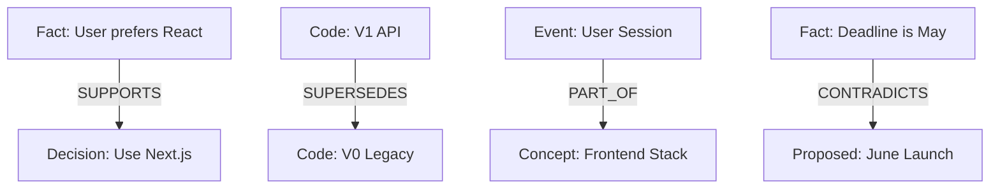

# 🧠 Cortex Memory Engine 2.0
> **Non-Linear Hierarchical Memory Engine: A Persistent Digital Brain for Sophisticated AI Agents**

[中文版 (Chinese)](README_ZH.md) | [English](README.md)

---

## 🌌 The Mission: Cognitive Inheritance

In traditional development, when a new AI Agent joins a project, it must consume massive amounts of tokens to "re-read" all code and documentation. **Cortex 2.0 is designed to break this inefficiency.**
New Agents simply connect to the Cortex and instantly inherit pre-digested **Project Facts**. We aren't just transmitting data; we are transmitting an existing "Cognitive Background."

---

## 🧠 Chapter 1: Cognitive Layering & Multi-Level Zooming

Cortex implements a **4-Layer Vertical Memory Model**, mimicking the human brain's progression from sensory input to high-level abstraction.

### 1. Data Layering Structure
- **Raw Input (Verbatim/L2)**: Stores 100% raw conversation or code snippets. Prevents loss of subtle detail.
- **Event Summary (Episodic/L1)**: Transforms Raw data into concrete events on a timeline ("What happened?").
- **Structured Facts (Fact/Semantic)**: De-temporalized knowledge extracted from events ("What does this imply?").
- **Abstract Concepts (Concept)**: High-dimensional semantic clusters enabling non-linear knowledge association.

### 2. Multi-Level Zooming
The system dynamically scales content granularity to optimize context usage:
- **L0 (Summary)**: 5% mass. Best for broad project overviews.
- **L1 (Logic)**: 25% mass. Best for understanding code logic and flow.
- **L2 (Raw Content)**: 100% mass. Best for exact code generation or reproduction.

---

## 🕸️ Chapter 2: Semantic Topology & Knowledge Graph

Cortex is not just a collection of isolated vector points; it is a knowledge graph with **semantic deductive capabilities**.

### Key Relationship Types (RelationType)
- **`SUPPORTS`**: Strengthens existing knowledge.
- **`CONTRADICTS`**: Flags logical conflicts for human review or AI re-inference.
- **`SUPERSEDES`**: Implements "Versioned Memory," automatically hiding legacy code/thoughts.
- **`PART_OF`**: Clusters details into broader thematic entities.

---

## 🔮 Chapter 3: Neural Ranking Metric Deep-Dive

How does the system decide "what to remember right now"? It is governed by a **12-dimensional dynamic convolution score**.

| Metric | Weight | Design Intent | Core Logic |
| :--- | :--- | :--- | :--- |
| **Similarity** | 20% | Relevance Foundation | Cosine similarity in vector space. |
| **Recency** | 12% | Ebbinghaus Decay | Natural exponential score drop over time. |
| **Importance** | 14% | Salience Weighting | Priority for core specs (L0) over trivial logs. |
| **Reinforcement** | 10% | Synaptic Strengthening | Higher usage frequency increases retrieval weight. |
| **Token Efficiency** | 10% | Context Optimization | Prioritizing high-density, summarized nodes. |
| **Novelty** | 4% | Redundancy Inhibition | Penalty for nodes highly similar to already retrieved items. |

---

## 💤 Chapter 4: Sleep Cycle & Knowledge Consolidation

Cortex runs background maintenance loops to ensure the brain doesn't "crash" from excessive noise. We call this the **Sleep Cycle**.

### 1. Intelligent Deduplication
When similarity > 0.96, the system merges duplicate memories into a single node, accumulating their importance weights.

### 2. Fact Distillation Pipeline
During rest cycles, the system's LLM scans `EPISODIC` (Event) memories to autonomously decide which experiences should be distilled into permanent `FACT` nodes.

---

## 📉 Chapter 5: Ebbinghaus Decay & Neural Pruning

To prevent memory explosion, Cortex implements a "pruning" mechanism.

### Decay Formula
$$S = e^{-\lambda \cdot t} \cdot (Importance + Boost)$$
- Memories with low importance and zero recent access will naturally hit the `Prune Threshold` (0.05).
- Nodes below this threshold transition to the `FORGOTTEN` state, freeing up vector index space.

---

## 📈 Chapter 6: Reinforcement & Synaptic Plasticity

Every memory possesses a **Success Count**.
- When an Agent utilizes a memory to successfully solve a problem (confirmed by positive feedback), the system triggers `reinforce()`.
- This permanently increases the memory's "Basal Importance," allowing it to be recalled like "Muscle Memory" in the future.

---

## 🛡️ Chapter 7: Privacy-First Local Brain Architecture

Cortex is designed to be an "Absolutely Private" brain.

- **Hardware Isolation**: Native support for Ollama `bge-m3` local embedding generation.
- **Air-Gap Capable**: All fact extraction and concept clustering can be performed offline.
- **Multi-Persona (Namespacing)**: Segregated memory sub-spaces to prevent cross-contamination between different developers or users.

---

## 🔌 Chapter 8: The MCP Bridge Architecture

Cortex is a native supporter of the **Model Context Protocol (MCP)**.

- **Standardized Access**: Any MCP-capable client (e.g., Claude Desktop or Cursor) can access your "Brain" as easily as a local directory.
- **Tool-Call Interface**: Agents can use tools like `recall_structured_memory` to directly operate the brain without complex code.

---

## 👁️ Chapter 9: Proactive Resonance Scanning

This is not a passive dictionary look-up.

- When new input is detected, the **Proactive Scanner** runs similarity pre-scans in the background.
- It actively searches for "Implicit Associations"—old technical decisions or preferences that are non-obvious—and pre-loads them into the Agent's working memory before it even begins to reply.

---

## 🚀 Chapter 10: Real System Visualization

### 1. 3D Neural Graph

*Observe thematic clustering and the "Cognitive Map" of your project.*

### 2. Episodic Timeline

*Precise chronological event tracking and retrieval.*

### 3. Developer Coding Sync

*Side-by-side management of L0 Requirements vs. Technical Snapshots.*

---
*Developed with Passion for the Evolution of AI Cognition.*
