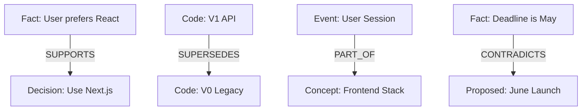

# 🧠 Cortex Memory Engine 2.0
> **非線性分層記憶引擎：為強 AI Agent 打造的「長效數位大腦」**

[中文版 (Chinese)](README_ZH.md) | [English](README.md)

---

## 🌌 核心使命：認知繼承 (Cognitive Inheritance)

在傳統開發中，當一個新的 AI Agent 加入專案時，它必須耗費大量 Token 去「重新朗讀」所有代碼與文檔。**Cortex 2.0 的設計用意是打破這種低效。**
新 Agent 只需要接入 Cortex，就能直接繼承已經過「消化、總結、關聯」的 **專案事實 (Facts)**。我們不是在傳輸數據，而是在傳輸一個已經存在的「認知背景」。

---

## 🧠 認知分層與多級縮放 (Cognitive Layering & Zooming)

Cortex 採用 **四層垂直記憶模型**，模擬人類大腦從感官輸入到高度抽象的處理過程。

### 1. 數據分層結構
- **原始輸入 (Raw/L2)**: 儲存 100% 原始對話或代碼快照。
- **事件摘要 (Episodic/L1)**: 將 Raw 轉化為時間軸上的具體事件（發生了什麼？）。
- **結構事實 (Fact/Semantic)**: 從事件中萃取的去時間化知識（這代表了什麼？）。
- **抽象概念 (Concept)**: 高維度的語意群集，實現非線性的知識聯想。

### 2. 多級縮放 (Zoom Levels)
系統支持在檢索時動態調整內容的「縮放深度」，確保 context 不會浪費：
- **L0 (Summary)**: 5% 體積。適合了解專案全貌。
- **L1 (Logic)**: 25% 體積。適合了解代碼邏輯。
- **L2 (Raw)**: 100% 體積。適合需要精確複製或代碼生成的場景。

---

## 🕸️ 語意拓撲與知識圖譜 (Semantic Graph Topology)

Cortex 並非只是孤立的向量點，它是一個具有 **語意演繹能力** 的知識圖譜。



### 關鍵關係類型 (RelationType)
- **`SUPPORTS`**: 驗證現有知識強度。
- **`CONTRADICTS`**: 警示邏輯衝突，需人工介入或 AI 重新推理。
- **`SUPERSEDES`**: 實現「版本化記憶」，自動隱藏過時的舊代碼。
- **`PART_OF`**: 將細節歸納入主題 cluster。

---

## 🔮 神經排名指標詳解 (Neural Ranking Metric)

系統如何決定「現在該想起什麼」？這由 **12 個維度的動態卷積分數** 決定。

| 指標 | 權重 | 設計用意 | 核心邏輯 |
| :--- | :--- | :--- | :--- |
| **語意相似度** | 20% | 相關性基礎 | 向量空間的餘弦相似度。 |
| **新鮮度 (Recency)** | 12% | 艾賓浩斯衰減 | 隨時間推移分數指數級自然下降。 |
| **核心重要性** | 14% | Salience 權重 | 區分專案規格 (L0) 與日常瑣事。 |
| **Reinforcement** | 10% | 突觸增強 | 越高頻被回傳為正確答案，權重越高。 |
| **Token Efficiency** | 10% | 認知成本優化 | 優先推薦已摘要、高密度的內容。 |
| **Novelty** | 4% | 冗餘抑制 | 懲罰與已召回內容高度重複的節點。 |

---

## 💤 睡眠週期與知識固化 (Sleep Cycle & Consolidation)

Cortex 不間斷運行維護循環，確保大腦不會因為過多噪音而「宕機」。我們稱之為 **Sleep Cycle**。

### 1. 智能去重 (Deduplication)
當相似度 > 0.96 時，系統會視為同一記憶的重複出現，自動合併節點並疊加其重要性分數。

### 2. 知識萃取流水線 (Fact Distillation)
在背景進程中，LLM 會掃描 `EPISODIC` (事件) 記憶，自主判斷哪些經歷值得沉澱為永久的 `FACT` (事實)。

---

## 📉 艾賓浩斯衰減與神經修剪 (Neural Pruning)

為了防止記憶爆炸，系統實施了殘酷的 **神經修剪機制**。

### 衰減公式 (Math)
$$S = e^{-\lambda \cdot t} \cdot (Importance + Boost)$$
- 若重要性極低且長期未被訪問，分數會降至 `Prune Threshold` (0.05)。
- 低於門檻的節點會變為 `FORGOTTEN` 狀態，釋放向量索引空間。

---

## 📈 強化學習與突觸塑性 (Reinforcement Feedback)

每一條記憶都有一個 **Success Count (成功計數)**。
- 當 Agent 在回覆中使用該記憶並得到正向反饋時，系統會調用 `reinforce()` 方法。
- 這將永久性地調高該記憶的「基礎重要性」，使其在未來的類似場景中像「肌肉記憶」一樣被瞬間喚醒。

---

## 🛡️ 隱私安全與在地化架構 (Privacy-First Local Brain)

Cortex 旨在成為一個「絕對私密」的大腦。

- **硬體隔離**: 支援 Ollama `bge-m3` 在本地生成嵌入。
- **空氣牆**: 所有事實萃取與概念群集均可離線完成。
- **多重人格 (Namespacing)**: 為不同的任務或 User 建立獨立的記憶子空間，防止數據交叉感染。

---

## 🔌 MCP 跨代理協議橋接 (The MCP Bridge)

Cortex 是 **Model Context Protocol (MCP)** 原生支持者。

- **Standardized Access**: 任何支持 MCP 的 Client (如 Claude Desktop) 都能像訪問文件夾一樣訪問您的「記憶」。
- **工具化調用**: Agent 可以通過 `recall_structured_memory` 或 `save_coding_memory` 直接操作大腦，無需編寫複雜代碼。

---

## 👁️ 主動式背景共鳴掃描 (Proactive Resonance)

這不是被動的查字典。

- 當系統檢測到新的 Input 時，**Proactive Scanner** 會在背景運行相似度預掃描。
- 它會主動尋找與當前任務具有「隱性聯想」的非顯性記憶（例如三個月前的技術決策），並在 Agent 開始回覆前完成加載。

---

## 🚀 實機演示與視覺化 (Visualization)

### 1. 3D 神經圖譜

*觀察數據的分簇現象，了解 Agent 的「知識版圖」。*

### 2. 事件時間軸

*實現跨時空的對話回溯與事件追蹤。*

### 3. 開發編碼同步

*專為高效開發設計的「需求 vs 快照」對照介面。*

---

## 🛠️ 快速開始 (Quick Start)

### 1. 環境需求
- [Python 3.10+](https://www.python.org/)
- [Git](https://git-scm.com/)
- [Docker Desktop](https://www.docker.com/products/docker-desktop/)
- [Ollama](https://ollama.com/) (用於在地化 Embedding)

### 2. 安裝步驟
```bash
# 克隆倉庫
git clone https://github.com/lowkon123/AI-Cortex-Memory-System.git
cd AI-Cortex-Memory-System

# 建立虛擬環境
python -m venv venv
.\venv\Scripts\activate

# 安裝依賴
pip install -r requirements.txt
```

### 3. 啟動服務
```bash
# 啟動向量數據庫
docker-compose up -d

# 初始化知識庫
python scripts/init_db.py

# 啟動 3D 儀表板
python dashboard.py
```

---
*Developed with Passion for the Evolution of AI Cognition.*
