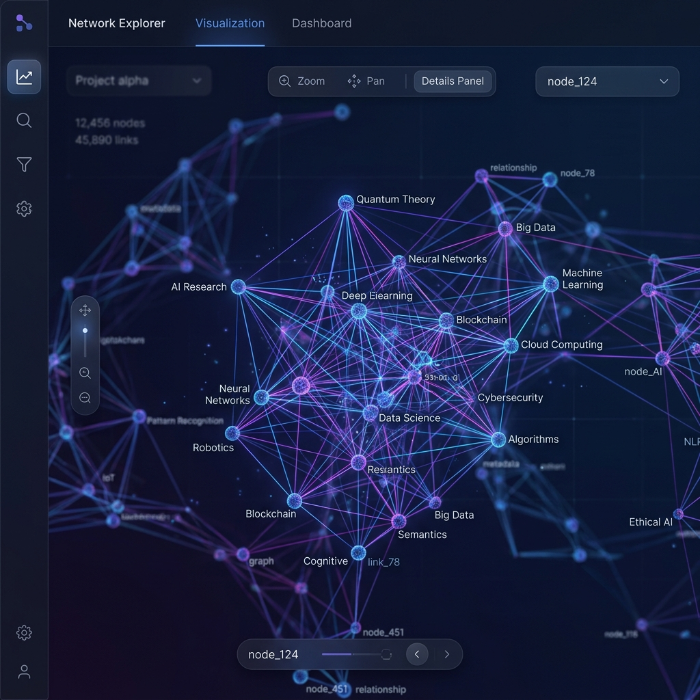
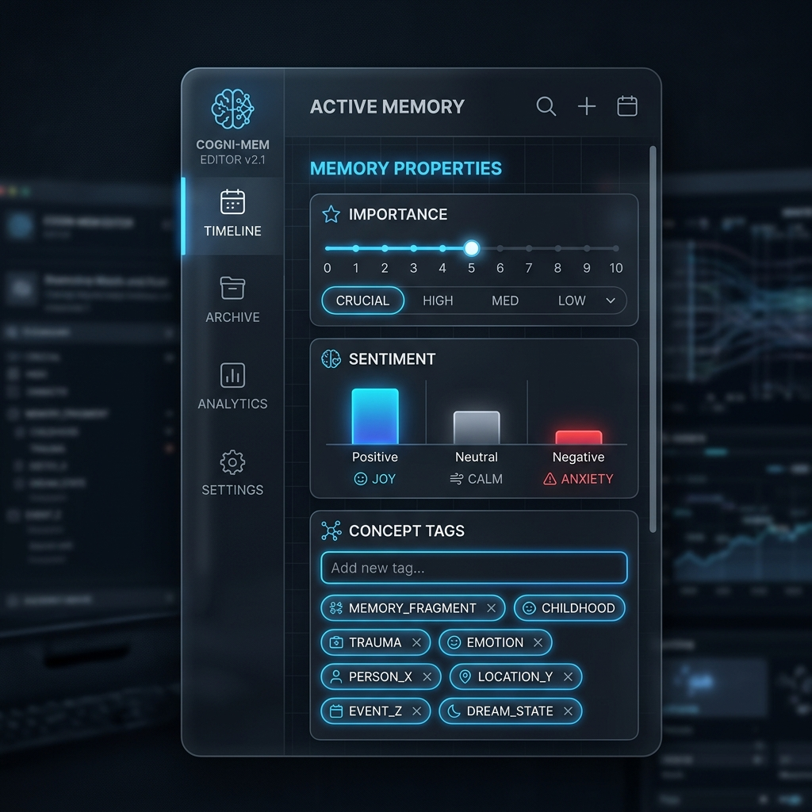
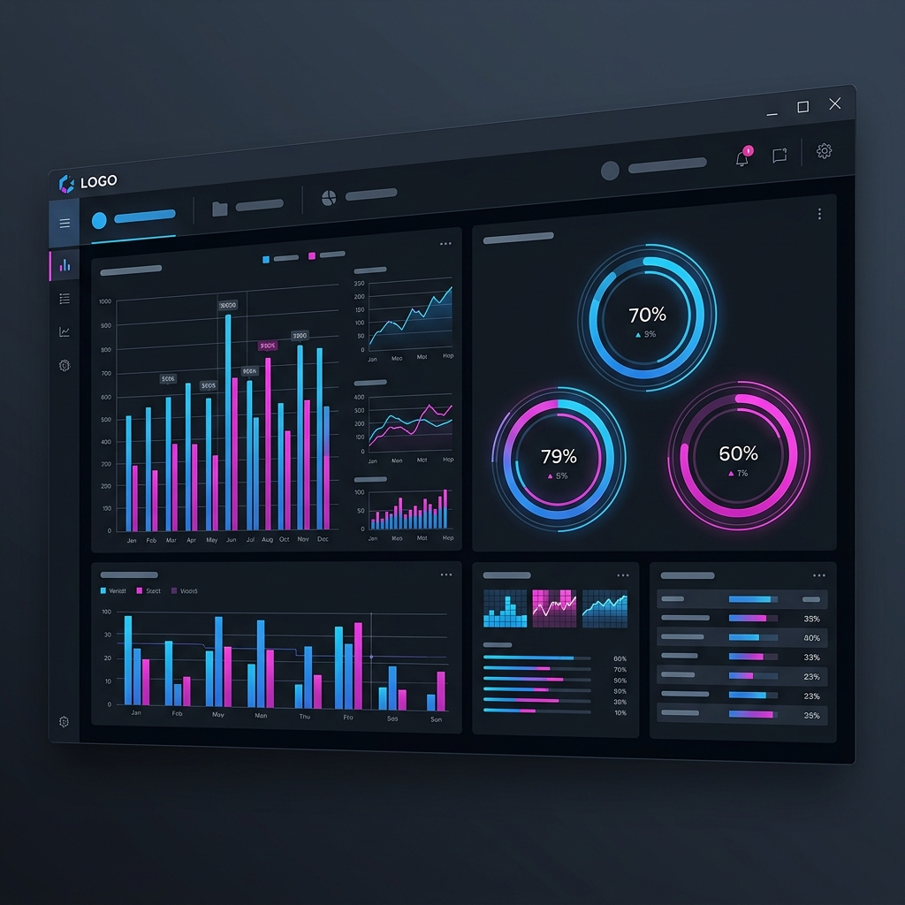
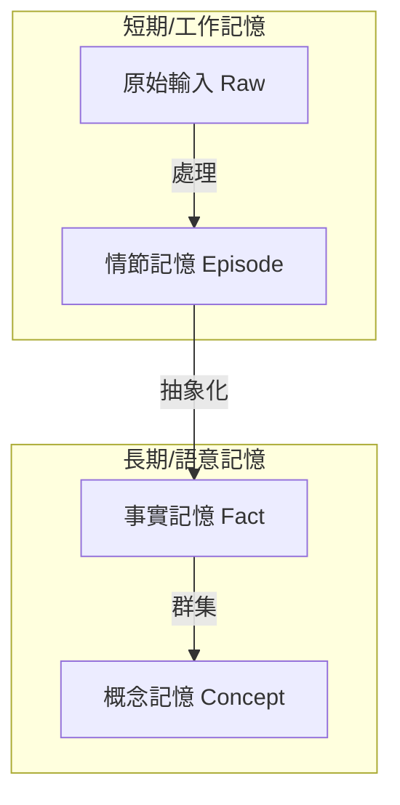

# 🧠 Cortex Memory Engine: AI Agent 的認知核心

[**English Version README**](README.md)

[](https://github.com/lowkon123/AI-Cortex-Memory-System/blob/main/LICENSE)
[](https://www.python.org/)

> 「Cortex 不是一個資料庫。它是賦予 AI Agent 時間感、連續性與結構化知識的認知層。」

Cortex Memory Engine 是一個高性能的層級式記憶系統，專為解決「LLM 健忘症」而設計。透過模擬人類的認知模式，它讓 AI 能在不爆炸 Token Context 的情況下，跨 Session 儲存、回想並自主整理資訊。

---

## 🚀 [屌!!!] 核心特性

- **自主事實萃取 (Fact Extraction)**：自動將瑣碎的對話提煉為結構化的持久事實。
- **層級認知堆棧 (Hierarchical Stack)**：四層記憶架構 (原始 -> 情節 -> 事實 -> 概念)，極大化 Token 使用效率。
- **語意知識圖譜 (Knowledge Graph)**：原生支持關係追蹤 (`supports`, `contradicts`, `causes`)。
- **混合搜尋引擎 (Hybrid Engine)**：結合全文檢索 (FTS) 與向量相似度 (Vector Similarity) 的強大檢索速度。
- **3D 互動儀表板**：透過 3D 群集與情緒極性即時視覺化 AI 的「思維」。

---

## 🎨 實機畫面展示 (Visual Showcase)

| 3D 知識圖譜 | 記憶編輯面板 | 認知數據分析 |
| :---: | :---: | :---: |
|  |  |  |

---

## 🏗️ 認知架構 (Architecture)

傳統向量資料庫將所有文本視為平等。Cortex 採用 **四層認知階層**：



1.  **原始輸入 (Raw)**：對話的原始紀錄。
2.  **情節記憶 (Episode)**：以時間為中心的事件摘要，記錄「今天發生了什麼」。
3.  **事實記憶 (Fact)**：關於使用者或專案的結構化知識（如：「使用者偏好 React」）。
4.  **概念記憶 (Concept)**：高階抽象術語與實體群集。

---

## 🕸️ 知識圖譜與語意連結

Cortex 不僅僅是在找「相似」的文字；它理解**關係**。當記憶被儲存時，Cortex 會建立有向邊：
- **`SUPPORTS` (支持)**：驗證現有知識。
- **`CONTRADICTS` (矛盾)**：標記衝突資訊，供人類或模型審核。
- **`PART_OF` (組成)**：將細節連結至更宏觀的情節。

---

## 🔍 混合認知檢索 (Hybrid Retrieval)

不再需要在「精確匹配」與「模糊搜尋」之間做選擇。Cortex 使用統一權重演算法：

| 因子 | 權重 | 描述 |
| :--- | :--- | :--- |
| **向量相似度** | 20% | 語意層級的覆蓋程度。 |
| **新近度 (Recency)** | 12% | 給予最近發生的事件額外加分。 |
| **重要性 (Importance)** | 14% | AI 或手動指定的重要性。 |
| **Token 效率** | 10% | 優先選擇精確的摘要而非冗長的原始碼。 |
| **新鮮度 (Novelty)** | 4% | 降低同一 Context 中重複資訊的權重。 |

---

## 📊 3D 視覺化儀表板

在 3D 環境中即時觀察您的 Agent 如何思考。
- **群集視覺化**：查看記憶區段如何根據主題自然成群。
- **情緒極性**：節點顏色反映記憶的情緒（正向/負向）。
- **即時互動**：直接在 UI 上編輯、刪除或手動建立記憶連結。

---

## 💤 自主記憶生命週期 (睡眠週期)

記憶不是靜止的。Cortex 在背景進行「維護」：
- **去重 (Deduplication)**：合併高度相似的記憶，節省 Token 空間。
- **神經衰減 (Decay)**：隨著時間淡化無效資訊，保持回想的純淨度。
- **整合 (Consolidation)**：將頻繁出現的情節模式轉化為持久的「事實」。

---

## 🛠️ 全自動安裝指南 (從零開始)

### 1. 必備工具
- [Python 3.10+](https://www.python.org/)
- [Git](https://git-scm.com/)
- [Docker Desktop](https://www.docker.com/products/docker-desktop/)
- [Ollama](https://ollama.com/) (提供本地 Embedding)

### 2. 環境架設
```bash
# 克隆代碼
git clone https://github.com/lowkon123/AI-Cortex-Memory-System.git
cd AI-Cortex-Memory-System

# 建立虛擬環境
python -m venv venv
.\venv\Scripts\activate

# 安裝依賴
pip install -r requirements.txt
```

### 3. 啟動服務
```bash
# 1. 下載向量模型
ollama pull bge-m3

# 2. 啟動向量資料庫 (PostgreSQL)
docker-compose up -d

# 3. 一鍵啟動 (Windows)
.\launch_services.bat
```

---

## 🔌 MCP 原生支援 (Cursor / Claude Desktop)

Cortex 完全相容 **Model Context Protocol (MCP)**。

**設定範例 (`.mcp.json`):**
```json
{
  "mcpServers": {
    "cortex": {
      "command": "python",
      "args": ["d:/路徑/到/cortex_mcp_server.py"]
    }
  }
}
```

---

## 🤖 自定義 Agent 接入

### 三端點模式 (3-Endpoint Pattern)
透過三個簡單的 HTTP 呼叫即可接入任何 AI：

1.  **`POST /agent/context`**：獲取針對當前提示詞排序後的背景資訊。
2.  **`POST /agent/store`**：儲存對話回合或重要的專案發現。
3.  **`POST /agent/reinforce`**：告訴 Cortex 哪些回想對任務最有幫助。

---

## 🗺️ 開發路徑 (Roadmap)

- [ ] **多模態記憶**：支援圖片與圖表 Embedding。
- [ ] **分佈式 Cortex**：跨多台機器同步記憶。
- [ ] **主動回想**：讓 Agent 能夠「做夢」並自動發現知識關聯。
- [ ] **時間流圖譜**：視覺化知識在數月間的演進。

---

## 📜 許可證與貢獻

Cortex 採用 MIT 許可證。歡迎任何形式的貢獻，一起打造 AI 認知的未來。

---
**Cortex Memory System - 為您的 AI 換上大腦。**
