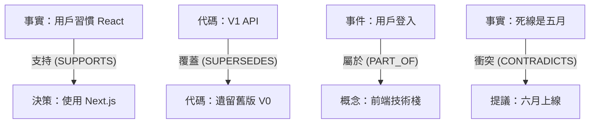

# 🧠 Cortex Memory Engine
> **非線性分層記憶引擎：為強 AI Agent 打造的「長效數位大腦」**

[中文版 (Chinese)](README_ZH.md) | [English](README.md)

---

## 🌌 核心使命：認知繼承 (Cognitive Inheritance)

開發者最頭痛的，就是每當新 AI Agent 進入專案，都要燒一堆 Token 讓它「重新讀檔」。**Cortex 的存在，就是為了終結這種低效行為。**

新來的 Agent 只要連上 Cortex，就能瞬間接收所有被「處理過、總結過、關聯過」的 **專案事實 (Facts)**。我們不只是在搬運數據，我們是在把「已經存在的大腦背景」直接同步給新的 AI。

---

## 🛠️ 快速開始 (Quick Start)

### 1. 環境需求
- [Python 3.10+](https://www.python.org/)
- [Git](https://git-scm.com/)
- [Docker Desktop](https://www.docker.com/products/docker-desktop/)
- [Ollama](https://ollama.com/) (用於在地化 Embedding 運算)

### 2. 安裝步驟
```bash
# 下載大腦
git clone https://github.com/lowkon123/AI-Cortex-Memory-System.git
cd AI-Cortex-Memory-System

# 建立環境
python -m venv venv
.\venv\Scripts\activate

# 安裝依賴庫
pip install -r requirements.txt
```

### 3. 啟動服務
```bash
# 喚醒向量數據庫 (PostgreSQL + pgvector)
docker-compose up -d

# 初始化知識庫
python scripts/init_db.py

# 啟動 3D 視覺化儀表板
python dashboard.py
```

---

## 🌟 Phase 2 認知進化：邁向生產級大腦

Cortex 經過第二階段深度演化，現已具備處理萬級數據與複雜人類語意的能力：
- **多意圖路由拆解 (Multi-Intent Routing)**：面對使用者的長篇大論與複合問題，系統會自動將其拆解為多條平行子查詢 (Parallel Sub-queries) 並進行結果去重合併，確保檢索零死角。
- **HNSW 向量索引架構**：底層 PostgreSQL 已植入 HNSW (Hierarchical Navigable Small World) 索引，實測在百萬級記憶節點的壓力測試下，依舊能保持毫秒級的向量相似度搜尋。
- **全自動認知整合 (Cognitive Consolidation)**：背景 `sleep_runner` 能主動將瑣碎的日常對話 (Episodic)「蒸餾」為高層次的通用規則 (Semantic Facts)，並自動降低舊片段的權重，避免污染檢索池。
- **動態視覺效能優化 (LOD)**：3D 視覺面板導入 Level of Detail 渲染機制。當節點突破 1,500 顆時，系統將自動暫停背景力學演算並隱藏冷節點，死守 60 FPS 的絲滑體驗。
- **因果演化追蹤線**：舊有決策被覆蓋時，畫面上會以極具辨識度的「紅色箭頭」繪製出 `SUPERSEDES` 演化路徑，讓架構的迭代歷程一目了然。

---

## 🔒 大腦維護與安全機制 (Cognitive Safeguards)

為確保 AI 認知的穩定性與數據安全性，Cortex 內建了多重保障機制：

### 1. 原始記錄層 (RAW Memory)
系統不僅儲存摘要，還擁有完整的 **原始記錄層**。所有輸入都會保留 L2 級別的原始版本，確保在任何時候都能回溯最真實的上下文，防止 AI 摘要過程產生幻覺或細節遺失。

### 2. 記憶分層 (Memory Layering)
實現了 **短期 (Working) 與長期 (Long-term) 記憶分層**。新資訊首先進入事件流，經過評估後才會沉澱為知識。這種分層有效防止了雜訊汙染 AI 的核心架構。

### 3. 壓縮與整理機制 (Compression & Consolidation)
內建 **智能壓縮機制**，透過 Sleep Cycle 定期進行重複資訊合併與知識精煉，在保持資訊完整性的同時，極大化提升 Token 利用率。

### 4. 記憶鎖定機制 (Memory Lock)
對於被判定為「高權重 (Importance)」或「高信心值 (Confidence)」的關鍵記憶，系統會自動啟動 **Lock 機制**。這些記憶將對隨時間產生的衰減 (Decay) 具備極高的抵抗力，確保核心規格與關鍵決策永不被覆蓋。

### 5. 軟刪除機制 (Soft Delete)
系統採用 **Soft Delete (軟刪除)** 邏輯。當記憶被判定為「遺忘」時，它僅是改變狀態 (Status) 而非物理刪除。這意味著所有歷史蹤跡在必要時都可以被恢復，為開發者提供了一層後悔藥。

### 6. 語意智慧檢索 (Memory Retrieval)
結合了 **向量相似度與全文檢索 (Hybrid Search)**。不論是尋找模糊的概念，還是檢索精確的代碼變數名，系統都能精準從百萬級數據中定位正確記憶。

### 7. 記憶進化與更新 (Memory Evolution)
記憶並非一成不變。透過 `Reinforcement` 機制，記憶會隨使用頻率與正確性不斷 **進化與優化**，神經連結會隨之加強，實現動態的自適應優化。

### 8. 數據安全機制 (Security)
採用 **多級持久化防範**。從原始數據到事實層的備份結構，確保即便是遇到硬體故障或系統重啟，AI 的核心認知結構也能夠完整保存。

### 9. 多級回退機制 (Memory Fallback)
當精煉後的知識 (Fact) 層無法滿足當前查詢的複雜度時，系統會自動觸發 **Fallback 機制**，回退檢索原始資料 (RAW)，確保回答的準確性與可靠性。

---

## 🧠 認知分層與多級縮放 (Cognitive Layering & Zooming)

Cortex 仿照人類認知過程，將資訊從「雜訊」過濾為「智慧」，並分為四層垂直結構。

### 1. 資訊分層結構
- **原始日誌 (Raw/L2)**: 100% 還原所有對話與代碼細節，確保不漏掉任何變數名。
- **事件流 (Episodic/L1)**: 將雜亂日誌整理成「時間軸上的故事」，讓 AI 知道事情發生的先後順序。
- **純粹事實 (Fact/Semantic)**: 脫離時間、精煉後的硬核知識（例如：「使用者偏好 React」）。
- **核心概念 (Concept)**: 最頂層的語意群集，讓 AI 具備「觸類旁通」的直覺能力。

### 2. 記憶縮放 (Zoom Levels)
系統能根據任務需求，自動調整給 AI 看的資訊精細度：
- **L0 (大綱模式)**: 體積僅 5%。適合讓 AI 快速了解專案全貌。
- **L1 (邏輯模式)**: 體積約 25%。提供核心技術細節。
- **L2 (全量模式)**: 100% 原始資料。適合處理代碼生成等需要極度精確的任務。

---

## 🕸️ 語意拓撲：不只是數據，是神經網路

Cortex 記憶不是孤立的點，而是一個具有 **邏輯推理能力** 的知識網。



### 連結類型 (RelationTypes)
- **`SUPPORTS`**: 加強現有知識的信心。
- **`CONTRADICTS`**: 警示矛盾，讓 AI 知道這裡有邏輯死角。
- **`SUPERSEDES`**: 自動隱藏過時資訊，實現「有條理的忘記」。
- **`PART_OF`**: 將碎片資訊歸納到正確的主題底下。

---

## 🔮 神經排名指標：決定「現在該想起什麼」

Cortex 如何決定哪條記憶最重要？由 **12 個維度的動態卷積算法** 自動計算。

| 指標 | 權重 | 設計初衷 | 運作邏輯 |
| :--- | :--- | :--- | :--- |
| **語意相似度** | 20% | 相關性基礎 | 向量空間中的餘弦對齊。 |
| **時間新鮮度** | 12% | 艾賓浩斯衰減 | 越久沒用的資訊，分數會越低。 |
| **核心重要性** | 14% | 關鍵權重 | 區分「專案規格」與「閒聊雜事」。 |
| **強化反饋** | 10% | 突觸增長 | 被 AI 成功採納的記憶，未來會更優先被想起。 |
| **Token 效率** | 10% | 認知成本優化 | 優先推薦「已經整理過的高密度摘要」來省錢。 |
| **新鮮感競爭** | 4% | 抑制開發疲勞 | 防止 AI 總是在講重複、冗餘的話。 |

---

## 💤 睡眠週期：自動固化與去重

就像人類一樣，Cortex 在背景會進行 **Sleep Cycle (睡眠循環)** 來整理思緒。

### 1. 智能去重整理
當系統發現兩條記憶高度相似時，會自動把它們「融合」，並把其重要性分數加總，減少雜訊。

### 2. 事實蒸餾流水線
在背景定時掃描「事件流」，自動判斷哪些開發經歷值得沉澱為永久的「硬核事實」。

---

## 📉 記憶衰減與神經修剪

我們設計了強大的 **修剪機制**，確保 AI 的大腦不會被垃圾資訊填滿。

### 衰減公式
$$S = e^{-\lambda \cdot t} \cdot (Importance + Boost)$$
- 如果一條記憶重要性低且長期沒被用到，它會自然「乾枯」。
- 分數低於門檻 (0.05) 的記憶會進入「遺忘狀態」，騰出寶貴的檢索空間。

---

## 📈 強化學習：讓大腦越用越靈敏

每一條記憶都有一個 **Success Count (成功次數)**。
- 只要 AI 在解決問題時引用了這條記憶並有效，大腦就會執行 `reinforce()`。
- 這像是在大腦路徑上「加粗神經」，讓這條知識在未來變成反射性的肌肉記憶。

---

## 🛡️ 隱私優先：絕對在地化的安全感

Cortex 是為「極度重視隱私」的開發者設計的私密大腦。

- **硬體層隔離**: 支援 Ollama 在本地端運算，內容絕不流向外網。
- **物理分區 (Namespacing)**: 為不同的 Agent 或專案隔開獨立的記憶空間，徹底杜絕數據交叉污染。

---

## 🔌 MCP 連接橋：跨工具的數據生命線

Cortex 原生支持 **Model Context Protocol (MCP)**。

- **標準化開關**: 讓 Claude Desktop 或 Cursor 像接外接硬碟一樣，直接存取您的「大腦」。
- **工具化指令**: AI 的 Agent 可以直接調用 `recall_structured_memory` 等指令，實現真正的自主記憶操作。

---

## 👁️ 主動式背景共鳴掃描 (Proactive Resonance)

這不只是「查字典」，這是「聯想力」。

- 當您輸入新東西時，**掃描器** 會在背景偷偷運行相似度比對。
- 它會主動挖出那些被埋沒的「隱藏連結」（例如三個月前的一個小決策），並在 AI 開始回答前就餵給它，實現傳說中的「神來一筆」。

---

## 🚀 實機演示：將思維看得一清二楚

### 1. 3D 神經圖譜

*即時觀察記憶的「聚落效應」，掌握 AI 的知識領土。*

### 2. 事件時間軸

*跨時空的事件精準回溯，讓對話歷史不再支離破碎。*

### 3. 開發編碼同步

*為了開發者設計的「需求 vs 快照」操作介面。*

---
*Developed with Passion for the Evolution of AI Cognition.*
